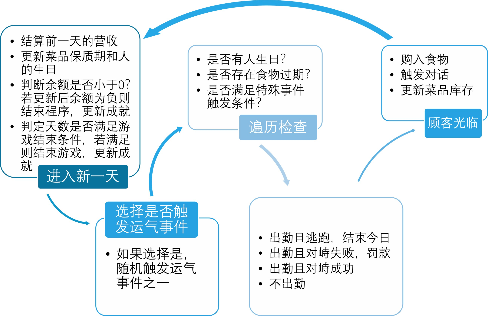
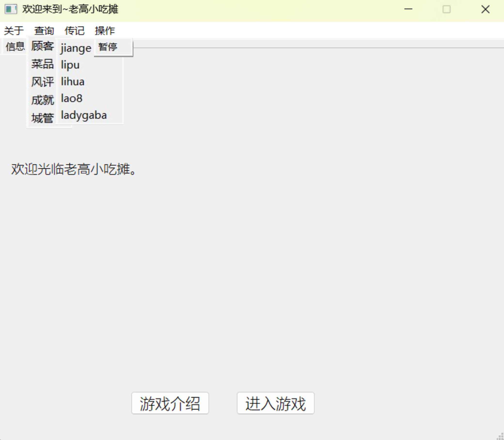
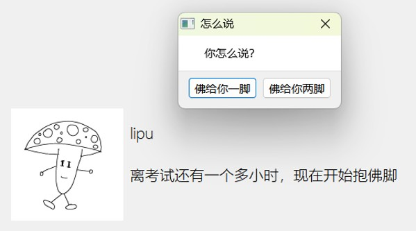

# 老高小吃摊


该项目似乎是在 2025 年 3 月 13 日通过 Qt Creator 创建的 。

这是一个C++大作业，是使用 Qt 框架开发的简单小吃摊模拟游戏。虽说做得比较简陋，不过做都做了，还是传上来纪念一下吧。

## 项目背景

•疫情后城市管理政策松绑，地摊经济回归日常

•经济环境低迷，大学生就业焦虑催生“java炒饭”等迷因

•受三饭启发

## 需求与功能分析

### 核心需求

再现走鬼的日常：和顾客交流、与城管博弈

### 核心功能

•顾客/城管信息管理与动态交互

•菜品与库存管理：进货、过期、排序、增删

•随机事件与非线性剧情

•成就记录、风评管理、状态提示等

### 功能与技术要求

| 功能模块     | 具体要求                                           | 技术实现                                                     |
| :----------- | :------------------------------------------------- | :----------------------------------------------------------- |
| **菜单管理** | 支持增删改查、按售价/保质期排序、库存预警          | 使用 vector 存储菜品数据，自定义 cmp1/cmp2 排序函数          |
| **顾客交互** | 好感度影响购买行为、生日送礼选项、多轮对话         | Guest 类继承 character，通过随机数与好感度计算购买逻辑       |
| **城管应对** | 随机出现、逃跑/硬刚选择、罚款与冲突次数记录        | Police 类维护执法难度与出现概率，通过对话框获取玩家选择      |
| **成就系统** | 实时监测资金、送礼次数等交互数据，解锁共 17 项成就 | QMap 存储成就状态，游戏结束时更新并写入 txt 文件             |
| **时间推进** | 每日更新保质期、生日倒计时，触发特殊事件           | 全局 day 变量控制时间流逝，通过 setbirth() 与 setdate() 更新状态 |
| **界面交互** | 多窗口菜单、数据可视化（如菜品列表、风评显示）     | Qt 设计师创建界面元素，信号与槽实现按钮事件绑定              |

## 整体设计思路

### 技术架构

C++搭配Qt框架，面向对象+事件驱动

### 系统模块化

•顾客、城管、菜品等分别封装为类

•信号槽机制联动交互

### UI设计

使用Qt Designer构建主界面+多弹窗查询交互

## 具体流程



## 程序界面





## 文件结构

```
.
├── shaokaotan-zhuanshengversion.pro # Qt 工程文件（.pro）
├── main.cpp # 程序入口
├── mainwindow.{cpp,h,ui} # 主窗口代码和 UI
├── dialog.{cpp,h,ui} # 搜索对话框（Searchdialog）模块
├── imagedialog.{cpp,h,ui} # 图像对话框模块
├── foodtotal.{cpp,h,ui} # 食材统计界面模块
├── resource.qrc # 资源文件
├── *.txt # 示例数据文件，如 jiange.txt、lipu.txt 等
└── *.user # Qt 自动生成用户配置文件（一般无需提交）
```

## 快速开始

### 克隆仓库

```
git clone https://github.com/T2ek1ng0/qt-snack_stand_game.git
cd qt-snack_stand_game
```

### 构建项目

```
qmake lgxiaochitan.pro
# 在 Linux 或 macOS 上
make

# 在 Windows (MinGW) 上
mingw32-make
```

### 运行程序

编译完成后，运行名为`lgxiaochitan` 的可执行文件。

